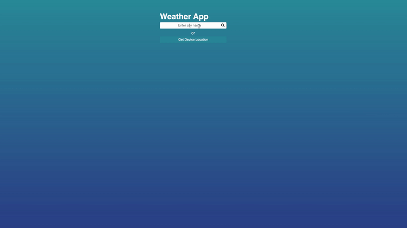

# Simple Weather App

This project demonstrates the basic constructs of web development
by providing an example web application.
It uses vanilla HTML, CSS and JavaScript to create an
easy to use Weather Application.

The project uses OpenWeather free current weather information
API to fetch latest weather data.

## Features

- Search for current weather for any city
- Use the `Get Device Location` button to get temprature of your local city
- Click the temprature to toggle between degree celcius and degree fahrenheit

## Usage

- Clone the repository to your machine
- Register for a free API key on [OpenWeather](https://openweathermap.org/price) that allows access to their APIs.
- Update `src/script.js` with your API Key.
- Simply open `index.html` in your favourite browser.

## Demo

Below image shows the weather application in action.

## Security

As the API key is embedded in the JavaScript file
it is advised to not publish this application as a publicly accessible web application.

If this is required, create a backend that
adds the API key to OpenWeather API calls.
